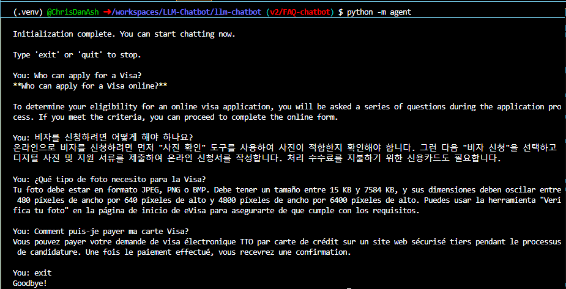

# LLM based TT Visa FAQ Chatbot

A Retrieval-Augmented Generation (RAG) chatbot for Trinidad and Tobago eVisa FAQs, built with LangChain. 

Features multilingual support, streaming responses, and PDF-based document retrieval to answer visa application questions accurately.

## Rationale
The official FAQs for Trinidad and Tobago’s electronic Visa (eVisa) system are currently available only in English, which creates a barrier for non-English speakers applying for entry. This project provides a multilingual, AI-powered chatbot that allows users to access accurate visa information in their own language. This system ensures that applicants can get reliable answers without needing English proficiency.

## Features

- **RAG Architecture**: Combines document retrieval with language model generation for accurate, context-aware responses
- **Multilingual Support**: Built-in translation capabilities for multiple languages
- **Streaming Responses**: Real-time output streaming for better user experience
- **Vector Store Integration**: Uses HuggingFace embeddings for semantic document search
- **Interactive CLI**: Simple command-line interface for chatbot interaction
- **Google Gemini Integration**: Powered by Gemini 2.5 Flash Lite language model

## How It Works

1. **Startup**: The chatbot loads and processes the TT eVisa FAQ PDF (`data/TT_Visa_FAQ.pdf`) at initialization
2. **Document Chunking**: PDF content is split into 500-character chunks with 50-character overlap
3. **Embedding**: Each chunk is embedded using HuggingFace's `all-mpnet-base-v2` model
4. **Query Processing**: User questions are matched against embedded chunks using semantic similarity
5. **Response Generation**: Google Gemini generates concise answers based on the most relevant chunks
6. **Multilingual Support**: Automatic language detection and translation for non-English queries

## Demo
This demo showcases the chatbot accurately answering questions about Trinidad and Tobago eVisa applications based on the official FAQ document, with support for multiple languages.




## Project Structure

```
llm-chatbot/
|
├── data/
│   └──TT_Visa_FAQ.pdf           #FAQ document
├── src/
│   └── agent/
│       ├── __init__.py
│       ├── __main__.py          # Entry point
│       ├── cli.py               # Command-line interface
│       ├── agent_builder.py     # Agent construction logic
│       ├── model.py             # LLM initialization
│       ├── config.py            # Configuration settings
│       ├── tools.py             # Agent tools (retrieval, etc.)
│       ├── streaming.py         # Response streaming logic
│       ├── translation.py       # Translation utilities
│       └── vectorstore.py       # Vector database management
├── tests/
│   └── test_agent.py            # Unit tests
├── requirements.txt             # Python dependencies
├── pyproject.toml              # Project metadata
├── .env.example                # Environment variables template
└── README.md
```

## Prerequisites

- Python 3.12+
- Google Gemini API key
- HuggingFace access token 
- LangSmith API key


## Installation

### 1. Clone the Repository

```bash
git clone https://github.com/ChrisDanAsh/LLM-Chatbot.git
cd LLM-Chatbot/llm-chatbot
```

### 2. Create Virtual Environment

```bash
python3 -m venv .venv
source .venv/bin/activate  # On Windows: .venv\Scripts\activate
```

### 3. Install Dependencies

```bash
pip install --upgrade pip setuptools wheel
pip install -r requirements.txt
```

### 4. Set Up Environment Variables

Copy the example environment file and add your API keys:

```bash
cp .env.example .env
```

Edit `.env` and add your keys:

```env
GOOGLE_API_KEY=your_google_api_key_here
HF_TOKEN=your_huggingface_token_here
LANGSMITH_API_KEY=your_langsmith_key_here
```

**Getting API Keys:**
- **Google Gemini**: https://ai.google.dev/
- **HuggingFace**: https://huggingface.co/settings/tokens
- **LangSmith**: https://smith.langchain.com/

### 5. Install Package (Editable Mode)

```bash
pip install -e .
```

## Usage

### Run the Chatbot

```bash
python -m agent
```

The CLI will start and prompt you for input. Type your questions and press Enter. The chatbot will stream responses in real-time.

**Example interaction:**
```
You: What is retrieval-augmented generation?
Assistant: [streaming response with context from vector store]

You: exit
```

Type `exit`, `quit`, or press `Ctrl+C` to exit.

### Run Tests

The project includes comprehensive unit tests, integration tests, and configuration validation.

Note: Ensure that you are in the llm-chatbot directory to run the tests

#### Run All Tests

```bash
pytest tests/ -v
```
#### Run Fast Tests Only (Skip Model Loading)
Some tests require loading the embedding model and PDF, which can be slow. To run only fast unit tests:
```bash
pytest tests/ -v -m "slow"
```
#### Run Specific Test Types
```bash
# Run only integration tests
pytest tests/ -v -m "integration"

# Run with code coverage report
pytest tests/ --cov=agent --cov-report=html

# Run a specific test file
pytest tests/test_agent.py -v

# Run a specific test function
pytest tests/test_agent.py::test_version -v
```

### Code Formatting

The project uses Black and Flake8 for code quality:

```bash
# Format code
black src/ tests/

# Check linting
flake8 src/ tests/
```

## Configuration

Edit `src/agent/config.py` to customize:
- **DOC_PATH**: Path to the FAQ PDF (default: `data/TT_Visa_FAQ.pdf`)
- **Chat Model**: Change the LLM (default: `gemini-2.5-flash-lite`)
- **Embedding Model**: Change the embedding model for vector search
- **Vector Store Settings**: Adjust chunk size, overlap, and storage path

## Known Limitations

- **Free Tier Rate Limit**: Google Gemini free tier has a limit of 20 requests/minute
  - Upgrade to a paid tier for production use: https://ai.google.dev/pricing
  - Rate limit errors will show retry messages
  
- ****PDF Document**: 
  - The chatbot only answers questions based on the TT eVisa FAQ PDF in `data/TT_Visa_FAQ.pdf`. To use a different document, replace the PDF and update `DOC_PATH` in `src/agent/config.py`. 
  
  - This method was selected since the website hosting the document does not allow the chatbot to access it directly.

- **Initialization time**: 
  - **First run**: Downloads the embedding model (~90MB, one-time download) and processes the PDF (~1 minute total)
  - **Subsequent runs**: Loads and processes the PDF at startup (~3-5 seconds)
  - The vectorstore is built in-memory at each startup, not persisted between sessions


## Troubleshooting

### Rate Limit Errors

If you see `429 ResourceExhausted` errors:
- Create a new Project on you Google API and create a new key for 20 more requests
- Monitor usage at: https://ai.dev/usage
- Upgrade your Google API tier

## Next Steps
- Implement web application with user friendly UI

## Acknowledgements
- Code based on RAG Tutorial from [https://docs.langchain.com/oss/python/langchain/rag#google-gemini]
- Built with [LangChain](https://github.com/langchain-ai/langchain)
- Powered by [Google Gemini](https://ai.google.dev/)
- Embeddings from [HuggingFace](https://huggingface.co/)

## Contact

- **GitHub**: [@ChrisDanAsh](https://github.com/ChrisDanAsh)
- **Repository**: https://github.com/ChrisDanAsh/LLM-Chatbot
